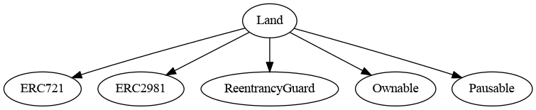

<div id="splash">
    <div id="project">
          <span class="splash-title">
               Project
          </span>
          <br />
          <span id="project-value">
               Casinoverse Land
          </span>
    </div>
     <div id="details">
          <div id="left">
               <span class="splash-title">
                    Client
               </span>
               <br />
               <span class="details-value">
                    Casino Metaverse
               </span>
               <br />
               <span class="splash-title">
                    Date
               </span>
               <br />
               <span class="details-value">
                    August 2022
               </span>
          </div>
          <div id="right">
               <span class="splash-title">
                    Reviewers
               </span>
               <br />
               <span class="details-value">
                    Daniel Luca
               </span><br />
               <span class="contact">@cleanunicorn</span>
               <br />
               <span class="details-value">
                    Andrei Simion
               </span><br />
               <span class="contact">@andreiashu</span>
          </div>
    </div>
</div>


## Table of Contents
 - [Details](#details)
 - [Issues Summary](#issues-summary)
 - [Executive summary](#executive-summary)
     - [Week 1](#week-1)
 - [Scope](#scope)
 - [Recommendations](#recommendations)
     - [Increase the number of tests](#increase-the-number-of-tests)
 - [Issues](#issues)
     - [Whitelisted addresses can mint more than maxMintPerAddress](#whitelisted-addresses-can-mint-more-than-maxmintperaddress)
     - [Modifier isValidAmount should check for strict equality](#modifier-isvalidamount-should-check-for-strict-equality)
     - [Some methods should be locked while the sale is active](#some-methods-should-be-locked-while-the-sale-is-active)
     - [Simplify withdraw and withdrawAll by sending the funds directly to withdrawalRecipient](#simplify-withdraw-and-withdrawall-by-sending-the-funds-directly-to-withdrawalrecipient)
     - [Use uint256 instead of uint8](#use-uint256-instead-of-uint8)
     - [Modifier isBalanceEnough is not needed](#modifier-isbalanceenough-is-not-needed)
 - [Artifacts](#artifacts)
     - [Surya](#surya)
 - [Sūrya's Description Report](#suryas-description-report)
     - [Files Description Table](#files-description-table)
     - [Contracts Description Table](#contracts-description-table)
     - [Legend](#legend)
     - [Coverage](#coverage)
     - [Tests](#tests)
 - [License](#license)


## Details

- **Client** Casino Metaverse
- **Date** August 2022
- **Lead reviewer** Daniel Luca ([@cleanunicorn](https://twitter.com/cleanunicorn))
- **Reviewers** Daniel Luca ([@cleanunicorn](https://twitter.com/cleanunicorn)), Andrei Simion ([@andreiashu](https://twitter.com/andreiashu))
- **Repository**: [Casinoverse Land](git@github.com:casinometaverse/casinoverse-land.git)
- **Commit hash** `bf607afe5ff68b91990649567347f333bb27f6be`
- **Technologies**
  - Solidity
  - Node.JS

## Issues Summary

| SEVERITY       |    OPEN    |    CLOSED    |
|----------------|:----------:|:------------:|
|  Informational  |  0  |  0  |
|  Minor  |  2  |  0  |
|  Medium  |  3  |  0  |
|  Major  |  1  |  0  |

## Executive summary

This report represents the results of the engagement with **Casino Metaverse** to review **Casinoverse Land**.

The review was conducted over the course of **1 week** from **August the 1st to August the 5th, 2022**. A total of **5 person-days** were spent reviewing the code.

### Week 1

During the first week, we 

- review code and start drafting some initial issues
- create a Fisher Yates proof of concept
- set up a meeting to discuss the issues
- work on the report
- present report

## Scope

The initial review focused on the [Casinoverse Land](git@github.com:casinometaverse/casinoverse-land.git) repository, identified by the commit hash `bf607afe5ff68b91990649567347f333bb27f6be`.

We focused on manually reviewing the codebase, searching for security issues such as, but not limited to, re-entrancy problems, transaction ordering, block timestamp dependency, exception handling, call stack depth limitation, integer overflow/underflow, self-destructible contracts, unsecured balance, use of origin, costly gas patterns, architectural problems, code readability.

**Includes:**
- code/contracts/Land.sol


## Recommendations

We identified a few possible general improvements that are not security issues during the review, which will bring value to the developers and the community reviewing and using the product.

### Increase the number of tests

A good rule of thumb is to have 100% test coverage. This does not guarantee the lack of security problems, but it means that the desired functionality behaves as intended. The negative tests also bring a lot of value because not allowing some actions to happen is also part of the desired behavior.

## Issues


### [Whitelisted addresses can mint more than `maxMintPerAddress`](https://github.com/akiratechhq/review-casinoverse-land-2022-08/issues/4)
 

**Description**

A user can call the method `batchMint` to mint a group of tokens. This method enforces a maximum number of tokens per whitelisted address using the modifier `isNFTBalanceExceedsMaxMintPerAddress`:


[code/contracts/Land.sol#L419-L432](https://github.com/akiratechhq/review-casinoverse-land-2022-08/blob/0c7e33d79303b0e0278aa10943580119b08c8778/code/contracts/Land.sol#L419-L432)
```solidity
    function batchMint(
        uint256[] calldata _tokenIds,
        string[] calldata _tokenURIs,
        bytes32[] memory _merkleProof
    )
        external
        payable
        whenNotPaused
        isCallerValid
        isTotalMintedExceedsMaxSupply(_tokenIds.length)
        isValidAmount(_tokenIds.length)
        isNFTBalanceExceedsMaxMintPerAddress(msg.sender, _tokenIds.length)
        isWhitelisted(_merkleProof)
    {
```

Each user is allowed to mint up to a maximum number of tokens defined as `maxMintPerAddress` as enforced by the modifier `isNFTBalanceExceedsMaxMintPerAddress`:


[code/contracts/Land.sol#L308-L321](https://github.com/akiratechhq/review-casinoverse-land-2022-08/blob/0c7e33d79303b0e0278aa10943580119b08c8778/code/contracts/Land.sol#L308-L321)
```solidity
    /**
    * @dev Throws if caller balance + amount of nft to mint 
    *      exceeds maxMintPerAddress
    *
    * @param _address address of minter
    * @param _nftQty amount of nft to mint
    */
    modifier isNFTBalanceExceedsMaxMintPerAddress(address _address, uint256 _nftQty) {
        require(
            (balanceOf(_address) + _nftQty) <= maxMintPerAddress,
            "Max nft per address reached"
        );
        _;
    }
```

This modifier is added to both methods that mint tokens `batchMint` and `mint`.

However, the check uses the user's current balance, not how many tokens they minted. The user's balance can be modified by sending the tokens to a different address and calling `batchmintMint` again, minting up to `maxMintPerAddress`. The user can send the tokens to a different address and repeat the process.

**Recommendation**

Use a mapping that counts how many tokens were minted for each address. This way, the user has no option to decrease the number used when making the verification in `isNFTBalanceExceedsMaxMintPerAddress`.

A suggestion is to use the current modifier `isNFTBalanceExceedsMaxMintPerAddress` to increase the count and do the check.

```solidity

// Define a mapping that counts how many tokens were minted per whitelisted address
mapping(address => uint256) mintedTokensPerWhitelistedAddress;

modifier isNFTBalanceExceedsMaxMintPerAddress(address _address, uint256 _nftQty) {
	// Increment the number of minted tokens
    mintedTokensPerWhitelistedAddress[_address] += _nftQty;

	// Check if the total number of minted tokens is allowed
    require(
        mintedTokensPerWhitelistedAddress[_address] <= maxMintPerAddress,
        "Max nft per address reached"
    );
    _;
}

```


---


### [Modifier `isValidAmount` should check for strict equality](https://github.com/akiratechhq/review-casinoverse-land-2022-08/issues/7)
 

**Description**

When a user calls the methods `mint` or `batchMint`, they need to provide the correct amount of ether in order to buy the tokens. The ether amount is checked in the modifier `isValidAmount`.


[code/contracts/Land.sol#L239-L247](https://github.com/akiratechhq/review-casinoverse-land-2022-08/blob/0c7e33d79303b0e0278aa10943580119b08c8778/code/contracts/Land.sol#L239-L247)
```solidity
    /**
    * @dev Throws if amount is not enough
    *
    * @param _nftQty quantity of nft to mint
    */
    modifier isValidAmount(uint256 _nftQty) {
        require(msg.value >= (mintPrice * _nftQty), "Invalid Amount");
        _;
    }
```

The check makes sure that the user sent the ether amount that is equal to or higher than the necessary one. 

```solidity
require(msg.value >= (mintPrice * _nftQty), "Invalid Amount");
```

**Recommendation**

Change the check to make sure the amount sent is exactly equal to the required amount. Making this change will protect the users from making mistakes and sending too much ether into the contract.


---


### [Some methods should be locked while the sale is active](https://github.com/akiratechhq/review-casinoverse-land-2022-08/issues/6)
 

**Description**

The owner has permission to change some important parameters while the sale is active:

- [`setMaxMintPerAddress`](https://github.com/akiratechhq/review-casinoverse-land-2022-08/blob/0c7e33d79303b0e0278aa10943580119b08c8778/code/contracts/Land.sol#L358-L370)
- [`ownerMint`](https://github.com/akiratechhq/review-casinoverse-land-2022-08/blob/0c7e33d79303b0e0278aa10943580119b08c8778/code/contracts/Land.sol#L438-L465)
- [`setMintPrice`](https://github.com/akiratechhq/review-casinoverse-land-2022-08/blob/0c7e33d79303b0e0278aa10943580119b08c8778/code/contracts/Land.sol#L509-L521)
- [`setMerkleRoot`](https://github.com/akiratechhq/review-casinoverse-land-2022-08/blob/0c7e33d79303b0e0278aa10943580119b08c8778/code/contracts/Land.sol#L599-L611)

The parameters controlled by these methods are very important for the users. 

A few examples of why these methods should be inactive while the sale is happening:

- owner can change the token price
- owner can change the merkle root
- owner can change the token limit sale per address

The users assume the contract they are interacting with is safe. This includes coding bugs and centralization issues, such as the owner being able to change the price mid-auction or changing the token limit sale.

**Recommendation**

Do not allow the methods to be called while the sale is active.


---


### [Simplify `withdraw` and `withdrawAll` by sending the funds directly to `withdrawalRecipient`](https://github.com/akiratechhq/review-casinoverse-land-2022-08/issues/2)
 

**Description**


[code/contracts/Land.sol#L249-L260](https://github.com/akiratechhq/review-casinoverse-land-2022-08/blob/0c7e33d79303b0e0278aa10943580119b08c8778/code/contracts/Land.sol#L249-L260)
```solidity
    /**
    * @dev Throws if withdrawalRecipient is invalid
    *
    * @param _withdrawalRecipient withdrawalRecipient passed by caller
    */
    modifier isValidRecipient(address _withdrawalRecipient) {
        require(
            withdrawalRecipient == _withdrawalRecipient,
            "Invalid Recipient"
        );
        _;
    }
```

There's only 1 valid account that funds can be sent to. Thus, the argument `_withdrawalRecipient` is not required.


[code/contracts/Land.sol#L669](https://github.com/akiratechhq/review-casinoverse-land-2022-08/blob/0c7e33d79303b0e0278aa10943580119b08c8778/code/contracts/Land.sol#L669)
```solidity
    function withdraw(address _withdrawalRecipient, uint256 _amount)
```


[code/contracts/Land.sol#L669](https://github.com/akiratechhq/review-casinoverse-land-2022-08/blob/0c7e33d79303b0e0278aa10943580119b08c8778/code/contracts/Land.sol#L669)
```solidity
    function withdraw(address _withdrawalRecipient, uint256 _amount)
```

**Recommendation**

Remove modifiers, send directly to `_withdrawalRecipient`


---


### [Use `uint256` instead of `uint8`](https://github.com/akiratechhq/review-casinoverse-land-2022-08/issues/5)
 

**Description**

**Recommendation**

**[optional] References**


---


### [Modifier `isBalanceEnough` is not needed](https://github.com/akiratechhq/review-casinoverse-land-2022-08/issues/1)
 

**Description**

This is not needed since the tx will fail anyway if not enough ether is available.


[code/contracts/Land.sol#L262-L270](https://github.com/akiratechhq/review-casinoverse-land-2022-08/blob/0c7e33d79303b0e0278aa10943580119b08c8778/code/contracts/Land.sol#L262-L270)
```solidity
    /**
    * @dev Throws if _amount exceeds contract balance
    *
    * @param _amount amount to withdraw
    */
    modifier isBalanceEnough(uint256 _amount) {
        require(_amount <= address(this).balance, "Not Enough Balance");
        _;
    }
```

**Recommendation**

Remove modifier since this will not change how the contract functions.

Keep the modifier `isBalanceNotZero` since this will not create a "no-operation" transaction that doesn't transfer any ether.


---


## Artifacts

### Surya

Sūrya is a utility tool for smart contract systems. It provides a number of visual outputs and information about the structure of smart contracts. It also supports querying the function call graph in multiple ways to aid in the manual inspection and control flow analysis of contracts.

## Sūrya's Description Report

### Files Description Table


|  File Name  |  SHA-1 Hash  |
|-------------|--------------|
| ./code/contracts/Land.sol | a326ec1307afd3a679ceaddaca7ecba5b73d9733 |


### Contracts Description Table


|  Contract  |         Type        |       Bases      |                  |                 |
|:----------:|:-------------------:|:----------------:|:----------------:|:---------------:|
|     └      |  **Function Name**  |  **Visibility**  |  **Mutability**  |  **Modifiers**  |
||||||
| **Land** | Implementation | ERC721, ERC2981, ReentrancyGuard, Ownable, Pausable |||
| └ | <Constructor> | Public ❗️ | 🛑  | ERC721 |
| └ | setPreviewURI | External ❗️ | 🛑  | onlyOwner |
| └ | setMaxMintPerAddress | External ❗️ | 🛑  | onlyOwner |
| └ | mint | External ❗️ |  💵 | whenNotPaused isCallerValid isTotalMintedExceedsMaxSupply isValidAmount isNFTBalanceExceedsMaxMintPerAddress isWhitelisted |
| └ | batchMint | External ❗️ |  💵 | whenNotPaused isCallerValid isTotalMintedExceedsMaxSupply isValidAmount isNFTBalanceExceedsMaxMintPerAddress isWhitelisted |
| └ | ownerMint | External ❗️ | 🛑  | onlyOwner isTotalMintedExceedsMaxSupply isNFTBalanceExceedsMaxMintPerAddress |
| └ | _batchMintNFT | Private 🔐 | 🛑  | |
| └ | _mintNFT | Private 🔐 | 🛑  | isTokenIdValid |
| └ | setMintPrice | External ❗️ | 🛑  | onlyOwner |
| └ | setWithdrawalRecipient | External ❗️ | 🛑  | onlyOwner |
| └ | setBaseTokenURI | External ❗️ | 🛑  | onlyOwner |
| └ | setContractURI | External ❗️ | 🛑  | onlyOwner |
| └ | tokenURI | Public ❗️ |   | isTokenExist |
| └ | setMerkleRoot | External ❗️ | 🛑  | onlyOwner |
| └ | pause | External ❗️ | 🛑  | onlyOwner |
| └ | unpause | External ❗️ | 🛑  | onlyOwner |
| └ | enableBaseURIMode | External ❗️ | 🛑  | onlyOwner |
| └ | disableBaseURIMode | External ❗️ | 🛑  | onlyOwner |
| └ | withdraw | External ❗️ | 🛑  | onlyOwner nonReentrant isValidRecipient isBalanceEnough |
| └ | withdrawAll | External ❗️ | 🛑  | onlyOwner isValidRecipient isBalanceNotZero |
| └ | _withdraw | Private 🔐 | 🛑  | |
| └ | getContractBalance | External ❗️ |   | onlyOwner |
| └ | getMerkleRoot | External ❗️ |   | onlyOwner |
| └ | getMaxMintPerAddress | External ❗️ |   | onlyOwner |
| └ | isValidMerkleProof | Private 🔐 |   | |
| └ | supportsInterface | Public ❗️ |   |NO❗️ |
| └ | setRoyaltyInfo | Public ❗️ | 🛑  | onlyOwner |


### Legend

|  Symbol  |  Meaning  |
|:--------:|-----------|
|    🛑    | Function can modify state |
|    💵    | Function is payable |

#### Graphs





#### Describe

```text
$ npx surya describe code/contracts/Land.sol       
npx: installed 64 in 7.099s
 +  Land (ERC721, ERC2981, ReentrancyGuard, Ownable, Pausable)
    - [Pub] <Constructor> #
       - modifiers: ERC721
    - [Ext] setPreviewURI #
       - modifiers: onlyOwner
    - [Ext] setMaxMintPerAddress #
       - modifiers: onlyOwner
    - [Ext] mint ($)
       - modifiers: whenNotPaused,isCallerValid,isTotalMintedExceedsMaxSupply,isValidAmount,isNFTBalanceExceedsMaxMintPerAddress,isWhitelisted
    - [Ext] batchMint ($)
       - modifiers: whenNotPaused,isCallerValid,isTotalMintedExceedsMaxSupply,isValidAmount,isNFTBalanceExceedsMaxMintPerAddress,isWhitelisted
    - [Ext] ownerMint #
       - modifiers: onlyOwner,isTotalMintedExceedsMaxSupply,isNFTBalanceExceedsMaxMintPerAddress
    - [Prv] _batchMintNFT #
    - [Prv] _mintNFT #
       - modifiers: isTokenIdValid
    - [Ext] setMintPrice #
       - modifiers: onlyOwner
    - [Ext] setWithdrawalRecipient #
       - modifiers: onlyOwner
    - [Ext] setBaseTokenURI #
       - modifiers: onlyOwner
    - [Ext] setContractURI #
       - modifiers: onlyOwner
    - [Pub] tokenURI
       - modifiers: isTokenExist
    - [Ext] setMerkleRoot #
       - modifiers: onlyOwner
    - [Ext] pause #
       - modifiers: onlyOwner
    - [Ext] unpause #
       - modifiers: onlyOwner
    - [Ext] enableBaseURIMode #
       - modifiers: onlyOwner
    - [Ext] disableBaseURIMode #
       - modifiers: onlyOwner
    - [Ext] withdraw #
       - modifiers: onlyOwner,nonReentrant,isValidRecipient,isBalanceEnough
    - [Ext] withdrawAll #
       - modifiers: onlyOwner,isValidRecipient,isBalanceNotZero
    - [Prv] _withdraw #
    - [Ext] getContractBalance
       - modifiers: onlyOwner
    - [Ext] getMerkleRoot
       - modifiers: onlyOwner
    - [Ext] getMaxMintPerAddress
       - modifiers: onlyOwner
    - [Prv] isValidMerkleProof
    - [Pub] supportsInterface
    - [Pub] setRoyaltyInfo #
       - modifiers: onlyOwner


 ($) = payable function
 # = non-constant function
  
```

### Coverage

No coverage available.

### Tests

```text
$ npm run test                                   

> casinoverse-land@1.0.0 test /home/daniel/Development/github.com/akiratechhq/review-casinoverse-land-2022-08/code
> hardhat test


  Land
    deployment
      ✔ deployer is owner
      ✔ should return the expected name and symbol
      ✔ should return MAX_SUPPLY
      ✔ should return withdrawalRecipient address
      ✔ should return the initial base uri
      ✔ should return the uri suffix
      ✔ should return merkle root
      ✔ should return max mint per wallet address
    setMintingPrice
      ✔ should return mintPrice
      ✔ should be able to set new minting price
      ✔ should emit event MintPriceChanged
    setMerkleRoot
      ✔ should be able to set new merkle root
      ✔ should emit event MerkleRootChanged (38ms)
    setWithdrawalRecipient
      ✔ sould be able to set new recipient address
      ✔ should emit event WithdrawalRecipientChanged
    setMaxMintPerAddress
      ✔ sould be able to set new max mint per wallet address (154ms)
      ✔ sould emit event MaxMintPerAddressChanged
    setBaseTokenURI
      ✔ sould be able to set new base token uri
      ✔ sould emit event BaseTokenURIChanged
    getContractBalance
      ✔ sould return contract balance
    pausing
      ✔ should return if contract is paused
      ✔ should be able to pause contract
      ✔ should be able to unpause contract
    enable disable base uri mode
      ✔ should be able to enable base uri mode
      ✔ should be able to disable base uri mode
      ✔ should emit event BaseURIModeChanged
      ✔ should return base uri if base uri mode is true
      ✔ should return token specific uri if base uri mode is false (76ms)
      ✔ should return preview uri if token uri is empty
    batch minting
      ✔ should be able to batch mint nft
      ✔ should emit event NFTBatchMint
      ✔ should be able to batch mint nft from using contract if owner (97ms)
      ✔ should not be able to batch mint if contract is paused, should be reverted with error message 'Pausable: paused' (42ms)
      ✔ duplicate token id, should be reverted with error message 'ERC721: token already minted'
      ✔ token id should not exceed max supply, should be reverted with error message 'Invalid token id'
      ✔ invalid mint price amount, should be reverted with error message 'Invalid Amount'
      ✔ maxed supply, should be reverted with error message 'Max Reached' (101ms)
      ✔ max mint per address, should be reverted with error message 'Max nft per address reached'
      ✔ not whitelisted, should be reverted with error message 'Not on whitelist'
      ✔ should not allow contract to call batch mint, should be reverted with error message 'Not allowed' (41ms)
    owner minting
      ✔ should be able to owner mint nft
      ✔ should emit event NFTBatchMint
      ✔ duplicate token id, should be reverted with error message 'ERC721: token already minted'
      ✔ token id should not exceed max supply, should be reverted with error message 'Invalid token id'
      ✔ maxed supply, should be reverted with error message 'Max Reached' (86ms)
      ✔ max mint per address, should be reverted with error message 'Max nft per address reached'
    minting
      ✔ should be able to mint nft
      ✔ should emit event NFTSingleMint
      ✔ should be able to mint nft using contract if owner (55ms)
      ✔ should be able to mint nft with different accs (316ms)
      ✔ token id should not exceed max supply, should be reverted with error message 'Invalid token id'
      ✔ token already minted, should be reverted with error message 'ERC721: token already minted'
      ✔ should not be able to mint if contract is paused, should be reverted with error message 'Pausable: paused'
      ✔ maxed supply, should be reverted with error message 'Max Reached' (89ms)
      ✔ invalid mint price amount, should be reverted with error message 'Invalid Amount'
      ✔ not whitelisted, should be reverted with error message 'Not on whitelist'
      ✔ max mint per address, should be reverted with error message 'Max nft per address reached' (77ms)
      ✔ should not allow contract to call mint, should be reverted with error message 'Not allowed'
    withdrawAll
      ✔ should be able to withdraw all balance (79ms)
      ✔ should emit event Withdraw (75ms)
      ✔ invalid recipient, should be reverted with error message 'Invalid Recipient'
      ✔ invalid balance, should be reverted with error message 'No Balance'
      ✔ caller is not owner, should be reverted with errror message 'Ownable: caller is not the owner'
    withdraw
      ✔ should be able to withdraw balance (49ms)
      ✔ should be able to withdraw balance (49ms)
      ✔ should be able to withdraw all balance (38ms)
      ✔ invalid recipient, should be reverted with error message 'Invalid Recipient'
      ✔ invalid balance, should be reverted with error message 'Not Enough Balance'
      ✔ caller is not owner, should be reverted with errror message 'Ownable: caller is not the owner'
    royalty info
      ✔ should return current royalty info
      ✔ should be able to set new royalty info
      ✔ should emit event RoyaltyInfoChanged
    setContractURI
      ✔ should be able to set new contract URI
      ✔ should emit event ContractURIChanged
    setPreviewURI
      ✔ should be able to set new preview URI
      ✔ should emit event PreviewURIChanged


  76 passing (9s)
```

## License

This report falls under the terms described in the included [LICENSE](./LICENSE).

<!-- Load highlight.js -->
<link rel="stylesheet"
href="//cdnjs.cloudflare.com/ajax/libs/highlight.js/10.4.1/styles/default.min.css">
<script src="//cdnjs.cloudflare.com/ajax/libs/highlight.js/10.4.1/highlight.min.js"></script>
<script>hljs.initHighlightingOnLoad();</script>
<script type="text/javascript" src="https://cdn.jsdelivr.net/npm/highlightjs-solidity@1.0.20/solidity.min.js"></script>
<script type="text/javascript">
    hljs.registerLanguage('solidity', window.hljsDefineSolidity);
    hljs.initHighlightingOnLoad();
</script>
<link rel="stylesheet" href="./style/print.css"/>
